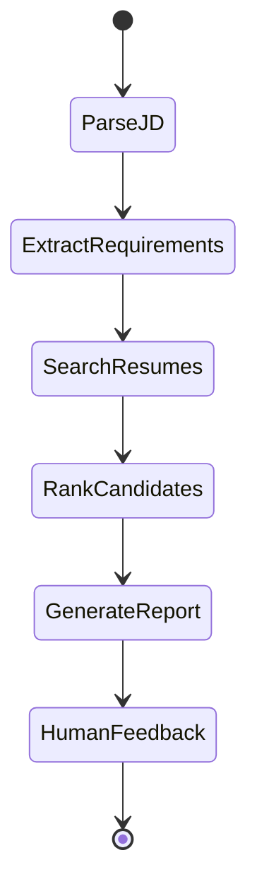

# Agentic Profile Matching System

## 📌 Project Overview
This project implements an **Agentic Profile Matching System** using **LangGraph**.  
It automates candidate-job matching by parsing job descriptions, searching resumes, ranking candidates, and generating explainable reports.

Key features:
- Conversational interface (CLI + Streamlit/Gradio UI).
- Multi-round screening with explainability.
- Candidate comparison and interview question generation.
- Iterative refinement of requirements mid-conversation.

---

## 🧩 Architecture

### Agent State Design
- Tracks conversation history.
- Maintains job requirements (must-have vs nice-to-have).
- Stores candidate shortlist and reasoning.

### Workflow

### Tools
- `extract_requirements(jd: str)` → Parse must-have vs nice-to-have.
- `compare_candidates(candidate_ids: list)` → Head-to-head comparison.
- `generate_interview_questions(candidate_id: str)` → Create screening questions.
- File system + RAG search integration.

---

## 📊 State Machine Diagram

💬Interactive Features
Conversational Interface  
Accepts natural queries like:

“Find me candidates with React and 3+ years experience.”

“Compare the top 3 matches side by side.”

“Why did John rank higher than Jane?”

Iterative Refinement  
Users can adjust requirements mid-conversation; agent re-ranks and explains changes.

Streamlit UI Buttons

Compare top candidates.

Generate interview questions.

Multi-round screening with explainability.

🚀 Advanced Capabilities
Multi-Round Screening

Round 1: shortlist top 10.

Round 2: deeper analysis.

Round 3: hire/no-hire recommendation.

Explainability

Strengths, gaps, improvement suggestions.

Transparent reasoning for rankings.

⚙️ Usage Instructions
Install dependencies
bash
pip install -r requirements.txt
Run CLI
bash
python matching_agent.py
Run Streamlit UI
bash
streamlit run app.py
Run Gradio UI (optional)
bash
python app_gradio.py
🧪 Test Scenarios
Basic JD Parsing  
Input: “We need a React developer with 3+ years experience.”
→ Agent extracts requirements, ranks candidates, generates report.

Candidate Comparison  
Click Compare Top 2 Candidates.
→ Side-by-side comparison explaining differences.

Interview Question Generation  
Click Generate Interview Questions for Top Candidate.
→ Produces tailored screening questions.

Iterative Refinement  
Input: “Add Docker as a must-have requirement.”
→ Agent updates requirements, re-ranks, explains changes.

Multi-Round Screening with Explainability  
Input: “Find me candidates with Python and AWS experience.”
→ Shortlist top 10, analyze, recommend hire/borderline with strengths/gaps.

Borderline Candidate Suggestions  
Input: “Why did Candidate C2 not qualify?”
→ Agent explains gaps and improvement suggestions.
